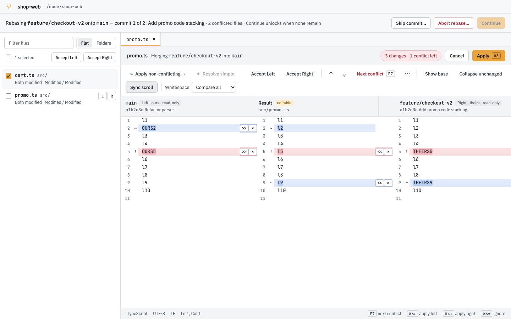
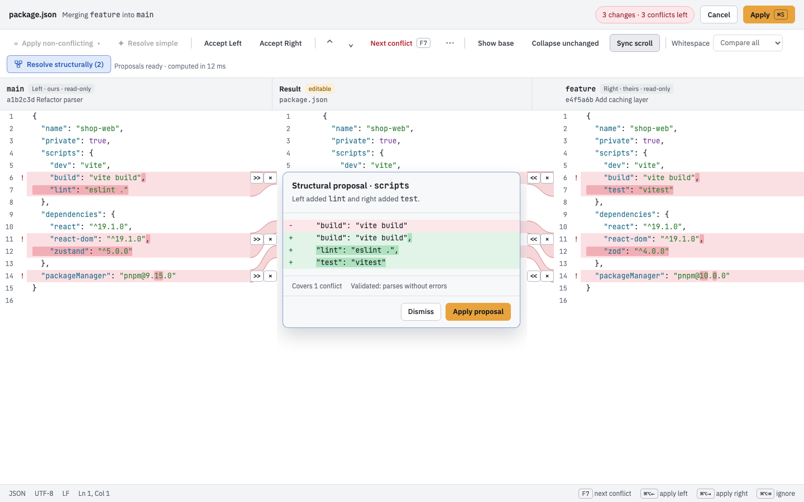
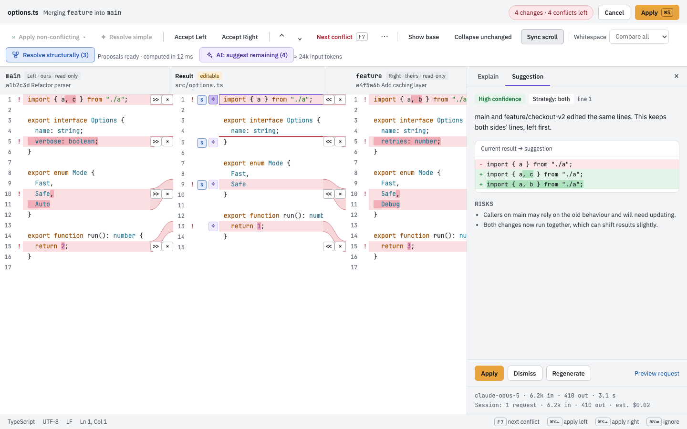
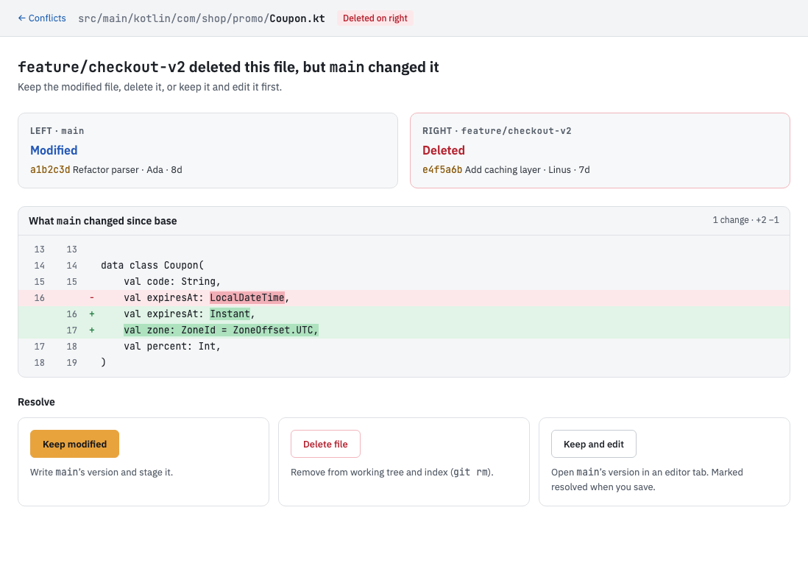

# MergeIQ

[](https://github.com/karthikkumararun/mergeIQ/actions/workflows/ci.yml)
[](https://github.com/karthikkumararun/mergeIQ/releases/latest)
[](LICENSE)

MergeIQ is an open-source, cross-platform desktop app for resolving git merge conflicts. It has a
three-way merge editor, a repository window that tracks a merge, rebase or cherry-pick across every
conflicted file, structural merging for code and config files, and optional AI help for the conflicts
that are left. It runs as a standalone app, as your `git mergetool`, and from the `mergeiq` command.

<picture>
  <source media="(prefers-color-scheme: dark)" srcset="docs/images/repo-conflicts-dark.png">
  
</picture>

_Screenshots in this README are rendered from the app's UI tests with sample data._

## Features

- **Three-pane merge editor.** Left, editable result and right, with per-change apply and ignore
  arrows, _Apply non-conflicting_, _Resolve simple_, _Show base_, _Collapse unchanged_, synchronized
  scrolling, whitespace policies and keyboard shortcuts. Line endings and encodings are preserved.
- **Repository window.** Shows which operation is in progress (merge, rebase, cherry-pick, revert or
  `git am`), lists every conflicted file, lets you resolve them in any order, accept a side for several
  files at once, and continue, skip or abort when none remain.
- **Structural merge.** Understands the syntax of Java, Kotlin, Python, JavaScript, TypeScript, Go, JSON
  and YAML, so changes that only look like conflicts (different imports, different keys, different
  members) become a one-click proposal with a preview.
- **Beyond text conflicts.** Dedicated panels for modify/delete, renames, binary files and images,
  symlinks, submodules, Git LFS pointers, very large files and lockfiles (including `go.sum` union and
  regenerate-with-confirmation for npm, pnpm, yarn, Poetry, Cargo and Gradle).
- **Optional AI assist.** Explains a conflict or suggests a resolution, validated before you apply it.
  Off until you opt in per repository; shows the exact request before sending; excludes `.env`, keys and
  other secrets by default; keys live in the OS credential store. Works with Anthropic, OpenAI, GitHub
  Models, or a local Ollama.
- **`git mergetool` and a CLI.** `mergeiq merge`, `mergeiq resolve` and `mergeiq open` work from any
  terminal; see [docs/git-integration.md](docs/git-integration.md).
- **Light and dark themes**, following your system by default.

<table>
  <tr>
    <td width="50%">
      <picture>
        <source media="(prefers-color-scheme: dark)" srcset="docs/images/structural-dark.png">
        
      </picture>
      <sub>Structural merge: both sides added a script, so one proposal keeps both.</sub>
    </td>
    <td width="50%">
      <picture>
        <source media="(prefers-color-scheme: dark)" srcset="docs/images/ai-suggestion-dark.png">
        
      </picture>
      <sub>AI assist: a suggestion with its confidence, risks and the exact diff to apply.</sub>
    </td>
  </tr>
  <tr>
    <td colspan="2">
      <picture>
        <source media="(prefers-color-scheme: dark)" srcset="docs/images/special-modify-delete-dark.png">
        
      </picture>
      <sub>Non-text conflicts get their own panels, here modify/delete.</sub>
    </td>
  </tr>
</table>

## Status

MergeIQ is at **v0.2**: early releases that are ready to try on real conflicts. Worth knowing:

- Installers are **not signed or notarized yet**, so macOS and Windows show a one-time warning on
  manually downloaded installers (the Homebrew install avoids it on macOS). See [Install](#install).
- It is developed and used mainly on macOS. Windows and Linux installers are built and tested in CI but
  have had less hands-on use.
- AI assist is new: the provider integrations are covered by mocked tests, and checks against live
  providers are still pending.

Planned work and history live in [`openspec/`](openspec/ROADMAP.md). Bug reports and ideas are welcome
as [issues](https://github.com/karthikkumararun/mergeIQ/issues).

## Install

On macOS with Homebrew (recommended: the app opens without a Gatekeeper warning):

```sh
brew install --cask karthikkumararun/tap/mergeiq
```

Or download the installer for your system from the [latest release](https://github.com/karthikkumararun/mergeIQ/releases/latest):

| System                                 | File                                                                   |
| -------------------------------------- | ---------------------------------------------------------------------- |
| macOS 10.15+ (Apple silicon and Intel) | `MergeIQ_<version>_universal.dmg`                                      |
| Windows (x64)                          | `MergeIQ_<version>_x64_en-US.msi` or `MergeIQ_<version>_x64-setup.exe` |
| Linux (x86_64)                         | `MergeIQ_<version>_amd64.AppImage` or `MergeIQ_<version>_amd64.deb`    |

Check a download with `sha256sum --check SHA256SUMS.txt` (macOS: `shasum -a 256 --check SHA256SUMS.txt`).
Installers are currently unsigned: for a downloaded `.dmg`, right-click the app › **Open** the first time
(or run `xattr -dr com.apple.quarantine /Applications/MergeIQ.app`); on Windows choose
**More info › Run anyway** in SmartScreen. The release notes say which installers are unsigned.
Then see [docs/git-integration.md](docs/git-integration.md) for the `mergeiq` command and `git mergetool`.
Maintainers: [docs/releasing.md](docs/releasing.md).

## Building from source

### Prerequisites

- [Rust](https://www.rust-lang.org/tools/install) (stable toolchain — see `rust-toolchain.toml`), with
  the `rustfmt` and `clippy` components.
- [Node.js](https://nodejs.org/) 22+ (see `.nvmrc`) and [pnpm](https://pnpm.io/) 9+.
- [cargo-nextest](https://nexte.st/) for running Rust tests.
- Platform prerequisites for [Tauri 2](https://tauri.app/start/prerequisites/):
  - **macOS**: Xcode Command Line Tools.
  - **Windows**: Microsoft C++ Build Tools (MSVC) and WebView2 (preinstalled on Windows 10/11).
  - **Linux**: see the Tauri docs for your distribution's WebView/GTK packages.

### Build and test

```sh
pnpm install
pnpm tauri dev      # run the desktop app in development mode
```

Other useful commands:

```sh
cargo fmt --check                        # Rust formatting
cargo clippy --workspace -- -D warnings  # Rust lints
cargo nextest run                        # Rust tests
pnpm --filter desktop lint               # TS/ESLint + stylelint
pnpm --filter desktop test               # Vitest
pnpm tauri build                         # production bundle
```

## Repository layout

```
crates/mergeiq-core     pure merge engine (no IO, no Tauri) — diff3, chunks, auto-resolve
crates/mergeiq-git      git adapter (conflict discovery, stage reads, resolve/stage)
crates/mergeiq-struct   tree-sitter structural merge
crates/mergeiq-ai       AI provider abstraction
apps/desktop/src-tauri  Tauri app, CLI entry, IPC commands
apps/desktop/src        React UI
openspec/               specs, designs and approved UI boards driving development
```

## Contributing

See [CONTRIBUTING.md](CONTRIBUTING.md). Please also read our
[Code of Conduct](CODE_OF_CONDUCT.md).

## License

Apache License 2.0 — see [LICENSE](LICENSE).
